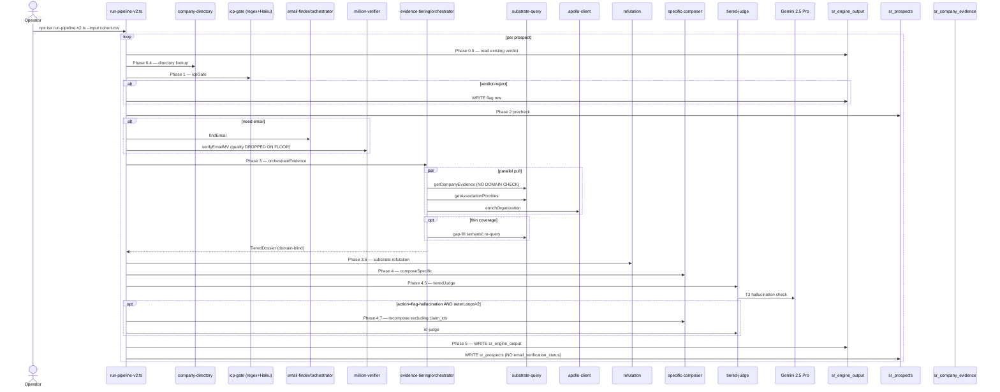

# Agent return status

| # | Agent | Status | Summary location |
|---|---|---|---|
| 1 | Composer chain | ✓ COMPLETED | /tmp/wave1-composer-chain.md |
| 2 | Judge chain | ✓ COMPLETED | /tmp/wave1-judge-chain.md |
| 3 | Substrate chain | ✓ COMPLETED | /tmp/wave1-substrate-chain.md |
| 4 | Pipeline chain | ✓ COMPLETED | /tmp/wave1-pipeline-chain.md |
| 5 | Email-finder | ✓ COMPLETED | /tmp/wave1-email-finder.md |
| 6 | Loader | ✓ COMPLETED | /tmp/wave1-loader.md |
| 7 | Safety + watcher | ✓ COMPLETED | /tmp/wave1-safety-watcher.md |
| 8 | Portal | ⚠ RATE-LIMITED — retry queued | |
| 9 | DB Schema mapper | ⚠ RATE-LIMITED — retry queued | |
| 10 | DB Fill-rate auditor | ⚠ RATE-LIMITED — retry queued | |
| 11 | Canon reader | ✓ COMPLETED | /tmp/wave1-canon-synthesis.md |
| 12 | Ops Builder persona | ⚠ RATE-LIMITED — retry queued | |
| 13 | Revenue Leader persona | ⏳ in-flight | |
| 14 | Technical Designer persona | ⚠ RATE-LIMITED — retry queued | |
| 15 | Design Document persona | ⚠ RATE-LIMITED — retry queued | |

---

# THE THREE UNIFYING PATTERNS

The 8 substantive returns aren't 8 independent issues. They surface **three large unifying patterns**:

## Pattern A — Unmanaged V1 → V2 migration

V2 (`evidence-tiering/run-pipeline-v2.ts`, the live production path) was supposed to replace V1 but never finished. Everywhere V2 fell short, V1 still has the feature, V1 is undeleted, V1 may even be referenced in operator handoffs as the path to run. This shows up everywhere:

- **Composer:** `prompt-optimizer.ts` (real DSPy) wired into V1, **never invoked by V2**
- **Substrate:** `intel-structurer.ts` wired into V1, **never invoked by V2**. This is the 23-null mystery — V2 writes only 4 of 30 intel fields.
- **Substrate:** `brain-ingest.ts` wired into V1, **V2 doesn't ingest research into Brain**
- **Email-finder:** V1 writes `email_verification_status: emailVerification.mvQuality`; **V2 writes nothing**. 100% of 36 cohort rows have NULL MV status because they all ran through V2. **Portal's "verified deliverable by MillionVerifier" copy is inferred from `confidence_color='green'`, not from a stored MV trace.**
- **Loader:** `supabase-adapter.ts` (V1 writer) hardcodes `meddpicc_decision_criteria: ''` and aliases `meddpicc_identified_pain := showrev_fit_rationale`. V2 writes its own persona-templated strings. Two parallel writers → same tables → drift.
- **Pipeline:** Both V1 and V2 write to the same tables. Re-running through the other leaves stale columns. **No single source of truth at the row level.** V1 is not even header-deprecated; `data/showrev/HANDOFF-P2-WET-RUN.md` references invoking it.
- **Safety:** `confidence-gate.ts` wired into V1, **never called from V2**. Two confidence systems exist.
- **V1 is broken at runtime:** V1 imports `seedFromSupabase`/`getBatchStats()`/`shouldHalt()` no-arg from current `bounce-monitor.ts`, which has no `seedFromSupabase` and requires `batchId` arguments. V1 throws `TypeError` at runtime when the seed step runs.

**Implication:** the system has been running on V2 for several months. Every piece of canon, every spec, every operator-set expectation was built on V1's feature set. V2 is the production stub.

## Pattern B — Source code that lies about itself (canon-drift in code comments)

Multiple files contain header comments or claims that grep contradicts. **The source code itself isn't trustworthy as documentation.**

- **`refutation.ts`** file header claims "intentionally NOT yet wired into run-pipeline-v2.ts." **Grep proves the opposite:** `run-pipeline-v2.ts` imports `checkSubstrateRefutation` at line 48 and calls it pre-compose at line 566.
- **`composer.ts`** has `// DEPRECATED` at line 1, but contains prompt strings that reference exactly the patterns `composer-constraints.COLD_COHORT_GUARDS` was built to reject ("Great connecting at Fiber Connect", "Tone: peer-to-peer... like a colleague following up after meeting at a conference"). Stranded code that would fail Tier-1 if re-enabled.
- **`cross-model-judge.ts`** filename, comments, and `JUDGE_MODEL_NAMES` array all promise GPT-5. **Lines 53 and 67 hardcode `gpt-4o` and `grok-3` to the API endpoints.** Operator sees "GPT-5" in logs; production calls a generation-older model.
- **`prompt-optimizer.ts`** has full working DSPy implementation. Only V1 imports it. V2 production path has no DSPy.

**Implication:** any forensic that trusts file-level documentation (i.e., what I was doing in my first pass before the operator forced this deeper dive) will be wrong. **All future audits must be grep-validated.**

## Pattern C — Safety gates that are theatre

Many gates exist as code but never fire in the live path. The "5 quality gates" the CEO brief promises are real for compose-time; the post-compose safety stack is mostly inert.

- **`circuit-breaker.ts`** — 76 LOC of textbook class with **zero callers**. Never instantiated.
- **`send-cap-monitor.ts`** — zero programmatic callers. The cap is observability only. **Justyn enforces the cap socially by telling AEs in the morning email.**
- **`bounce-monitor.ts`** — well-designed (DB-backed, 5%/10% thresholds). Fires **only when operator manually runs `watcher.ts deliverability`**. No scheduled execution.
- **`watcher/engagement-feed.ts`** — dead parallel implementation of the watcher. Zero callers. Risks future engineer wiring two conflicting Brain update paths.
- **`semantic-verifier.ts`** (162 lines, entire file): LLM-driven per-claim web-search verifier. Only callers are `run-verification-sweep.ts` (manual one-off) and `verify-wiring.ts` (smoke test). **Audit theater** — sophisticated dead code creates false trust.
- **`judges.ts` Recipient Proxy + Skeptic** (~150 lines): two of three advertised adversarial judges. Imported by `premium-pipeline.ts` and never called. **Operator-visible deception: codebase advertises 3 judges; production calls 1.**
- **`verify-facts.ts`** has the domain-aware 4-tier classifier (zoominfo→Tier 3). **Zero production callers.** The defense exists, is policy-correct, is dead code.
- **`confidence-gate.ts`** (System B) — never called from V2. Second confidence system with MV-aware scoring never runs.
- **`refutation.ts`** **DoS vulnerability**: 5-second Haiku timeout, **no retry on abort** (decided 2026-06-09). Anthropic slow day → cohort halts. No fallback model.
- **Hallucination-check repudiation attack:** force Gemini to return malformed JSON; `parseHallucinationResponse` returns `verdict='split'` (line 488); decision rule at line 622-625 requires `verdict==='fail'` to flag. **Split fails open. Adversary bypasses the only always-on substrate-faithfulness check.**

**Implication:** the CEO brief promises "nothing ships unchecked." For compose-time quality, that's true (mechanical regex, Tim-pattern, always-on Gemini hallucination check all fire). For post-compose deliverability + safety, it isn't. **Inorsa is currently sending behind a hallucination check that does fire, with a bounce/cap monitor that only fires when Justyn remembers to run a CLI.**

---

# Most explosive individual findings

## 1. Cross-LLM data egress
Every fan-out sends full substrate + email body to four third-party LLMs (OpenAI, xAI, DeepSeek, Google). **No zero-retention contracts referenced.** BRMEMC's "21,000 subscribers" leaves perimeter to four vendors per invocation. For a product that aspires to serve enterprise B2B clients, this is a contractual risk we haven't addressed.

## 2. The 93.3 portal score violates its own spec
`send-confidence-system-spec` says "uncalibrated weights = warning banner." The portal shows Gabriel's composite as 93.3 with `v1.0-uncalibrated` flag but no banner. **The spec's own warning rule isn't rendered.** Per canon-reader, this is a documented "implementation-vs-spec gap."

## 3. ICP gate "miss" verdict is structurally unreachable
`inferIcpVolumeVerdict` (orchestrator.ts line 332) **never returns 'miss' from a default code path**. ICP volume gate has only `fit`/`leaning_fit` by default. The asymmetric inclusivity bias is structural, not just prompt-level.

## 4. ICP regex patterns differ across files
`icp-gate.ts`, `prioritizer.ts`, and `p2-processor.ts` each have their own ICP regex patterns — similar but not identical. The patterns ban "business development" titles. **This would skip Ben Lewis-Ramirez, Director of Business Development at CNE** — an A&E firm the operator explicitly recognizes as in-scope. ICP gate has been silently rejecting valid prospects.

## 5. Best-of-N retry selector is broken
`scoreAttempt` in `composer-constraints.ts:738` has a regex-vs-string mismatch. It looks for `Body is \d+ words` and `Body has \d+ paragraphs`. Actual composers emit `Total (body + P.S., URL excluded) is X words` and `Body has X paragraphs — must be exactly 3`. The first regex never matches → word-count failures fall through to `-10` catch-all instead of `-30`. **Best-of-N selector silently picks attempts with bad word counts over attempts with banned phrases.**

## 6. Generalized composer disables citation gate
`generalized-composer.ts:426` hardcodes `checkCitationCoverage(candidate.bodySentences, 0)` — making the gate a no-op for the dominant cold-cohort mode. Documented as intentional. The "every claim must cite substrate" promise applies only to specific mode, not generalized.

## 7. Hallucination check repudiation
Force Gemini to return malformed JSON; `verdict='split'` is returned; decision rule requires `verdict==='fail'` to flag. **Split fails open.** This is the only always-on substrate-faithfulness check.

## 8. Cross-model judge calls stale models
Lines 53 + 67 hardcode `gpt-4o` and `grok-3`. Filename + comments + JUDGE_MODEL_NAMES array all promise GPT-5. **Operator sees "GPT-5" in logs; production calls a generation-older model.** Quality assumption is stale.

## 9. Refutation file lies about itself
Header comments claim "intentionally NOT yet wired." Grep proves it IS wired at run-pipeline-v2.ts:48 + 566. **The source code's own documentation is canon-drifted.**

## 10. MV result dropped on the floor
V2 pipeline does not persist any MV quality data. 100% of cohort `email_verification_status` is NULL. Portal copy "verified deliverable by MillionVerifier" is inferred from `confidence_color='green'`. **Cannot audit historical MV calls, cannot compute green-vs-actual-good rate.**

---

# Operator's stated vision (from canon reader)

Quoted from `P2-PILOT-ALIGNMENT.md` (2026-06-08):

> "We have everything we need to generate an amazing cold prospecting campaign that's better performing than the top 0.01% of AEs."

The thesis (canon-reader synthesis):

- **Substrate is the differentiator** — Inorsa positioning + ~4,005 industry files (podcasts, BEAD filings, Dawson blog, Community Broadband Bits, Fiber for Breakfast) + 1st-party prospect data = *more context than 0.01% of AEs ever have access to*.
- **The job is to USE all of it**, not waste 99%.
- **Compounding asset thesis:** 3-layer Brain pyramid (Client/Show → Industry → Universal) productizes the methodology beyond fiber.
- **Bulletproof generalized fallback** matters because substrate is not the constraint at every prospect — warming throttles daily volume anyway. **Goal: defensible always, exceptional when possible.**

# DO NOT re-derive (canon-reader's gift to the forensic narrative)

These documents already exist and are good. I will CITE them, not re-write them:

1. **`docs/showrev/gates-inventory-2026-06-09.md`** — 62 numbered gates with file:line + what they check + pass/fail actions + fail destinations. **Authoritative gates reference.** I should refresh against my findings (some gates noted there are stranded per my Wave 1).
2. **`docs/showrev/code-wiring-audit-2026-06-09.md`** — 5 priority cleanups already identified incl. prompt-optimizer.ts and email-finder/index.ts barrel.
3. **`docs/showrev/red-team-2026-06-09.md`** — 4 already-documented CRITICAL conflicts:
   - (a) persona-detector split brain (influence.ts vs generalized-composer.ts:87)
   - (b) word-count disagreement (SoT ≤80w body, composers ≤100w body+P.S., judge ≤100w body alone)
   - (c) em-dash leak in microsite (composers strip, microsite-composer doesn't)
   - (d) `send_status` write inconsistency between sr_engine_output and sr_prospects — portal can show different status than engine output
4. **`docs/showrev/send-confidence-system-spec-2026-06-10.md`** — 3-axis model + operator-calibration gate spec. Implementation gap: composite_score shipped, axis details NULL on 120 rows.
5. **`docs/showrev/brain-architecture-spec.md`** — full Brain schema. Tables exist mostly empty.
6. **`docs/showrev/post-approval-spec-2026-06-10.md`** — Phases A-H of send-side with HubSpot webhook taxonomy.

---

# Composer chain (full report in /tmp/wave1-composer-chain.md)

### Surprises
1. **`prompt-optimizer.ts`** = working DSPy implementation, real `BootstrapFewShot(emailMetric, ...)` with `claude-sonnet-4-6`. **Wired into V1, never called by V2.** Real DSPy investment, zero production impact.
2. **`scoreAttempt` regex bug at composer-constraints.ts:738** — Best-of-N silently broken.
3. **Two `microsite-composer.ts` files** with entirely different output schemas. V1 (no-LLM, hardcoded case studies) vs V2 (LLM-driven, bloom+headline). Both alive.

### Wiring gaps
1. **Generalized-composer disables citation gate.** `composer-constraints.checkCitationCoverage` is called with hardcoded `0` second arg. No-op for the dominant mode.
2. **`composer.ts` deprecated but still has prompt strings that fail Tier-1.** Stranded danger.
3. **`specific-composer.ts` and `generalized-composer.ts` are NOT imported by `run-pipeline-v2.ts`** per grep — only by tests and each other. Either indirect re-export OR V2 has a wiring gap. **Worth verifying.**

### Scale risks
1. `lean-composer.ts:86` execSync per attempt, 300s timeout, no parallelism → 800 prospects worst case ~133 hours
2. Best-of-N × 60s timeout → up to 80 hours composition
3. PITCH_VERBATIM + PERSONA_FRAMING duplicated verbatim across specific + generalized composers

# Substrate chain (full report in /tmp/wave1-substrate-chain.md)

Contamination path verified line-by-line (above in Pattern A + B). Plus:
- **`verify-facts.ts`** stranded (zero V2 callers)
- **`intel-structurer.ts`** stranded in V2 (explains 23-null mystery)
- **`brain-ingest.ts`** V1 only — V2 doesn't ingest research into Brain
- **`frame-registry.ts`** wired into `refutation.ts` only, shipping with 5 seed frames vs Phase B catalog that never landed
- **Brain learning loop is dormant on outcomes side** — no caller pipes `sr_outcomes` or `sr_email_experiments` back into Brain. `searchBrain` is read-only.

# Email-finder (full report in /tmp/wave1-email-finder.md)

### MV-persistence (definitive line-cited)
- `million-verifier.ts:73-99` returns `{quality, result, free, role, subresult, didYouMean}`
- `orchestrator.ts` invokes MV at 6 sites, **folds quality into local color decision and discards**. `EmailFinderResult` type (lines 36-48) has no `mvQuality` field.
- `run-pipeline-v2.ts:1340-1372` omits `email_verification_status`, `email_verified`, `email_provider`, `verification_report` entirely
- V1 wrote them; V2 doesn't; recent runs all V2 → 100% NULL on 36 cohort rows

### Two confidence systems
- **System A** (orchestrator.ts, ACTIVE): qualitative color decisions per branch
- **System B** (confidence-gate.ts, DEAD): score-based with MV adjustments — `good +20 / catch_all -10 / bad -60 / disposable -80`. **Never called from V2.**

### 5 fail-open paths in domain-resolver
- Person+Email Search picks `emails[0]` even when none name-match (line 464) — returns `'high'` confidence — DANGEROUS
- Website Extraction trusts operator-provided URL implicitly (lines 720-732)
- Heuristics promotes MX-verified speculative slug+suffix domains
- `pinDomain` set → alt-domain verification SKIPPED (lines 737-740)
- DMARC `rua=` detection wired but **bypassed by orchestrator Step 2** — 8-12% coverage loss per tactic-eval

# Loader (full report in /tmp/wave1-loader.md)

### TWO `runVerify` functions same name
- `preload-verify.ts`: 6-check deliverability orchestrator (SPF/DKIM/DMARC/HS_AUTH/EXISTING/UNSUBSCRIBE)
- `hubspot-loader.ts`: separate 10-check internal verify (microsites, AE ownership, content, fields)
- **Loader CLI calls its own internal one**, so the preload-verify orchestrator with DNS posture checks **appears stranded**

### 3 structural gaps
1. **No substrate-cleanliness gate** anywhere in load path. ZoomInfo-derived `company_summary` ships verbatim to HubSpot.
2. **No duplicate-contact race protection.** Read-then-write for companies (L271-310) and contacts (L312-323), no transaction or idempotency. HS-side dedup-on-email mitigates contacts; companies exposed.
3. **`supabase-adapter.ts` (V1) hardcodes `meddpicc_decision_criteria: ''`** at L262 and aliases `meddpicc_identified_pain := showrev_fit_rationale` at L260.

### Operator footguns
- `--skip-verify` flag (L791)
- `run-verification-sweep.ts` (49 lines, zero annotation) toggles `verified` flag the loader never reads

# Safety + watcher (full report in /tmp/wave1-safety-watcher.md)

### Real safety nets (only when operator runs CLI)
- `bounce-monitor.ts` — fires correctly only when operator manually runs `watcher.ts deliverability`. **No scheduled execution.**
- `confidence-gate.ts` — wired into V1, watcher CLI. **Not wired into V2.**
- `m1-email-find/watcher.ts` — operator-CLI tool that does HubSpot polling → `sr_outcomes`, sentiment classification → `sr_brain_outcomes`, pattern aggregation → `sr_brain_outreach_patterns`, deliverability halt check. **No scheduled execution.**

### Theatre
- `circuit-breaker.ts` — **zero callers**. Never instantiated.
- `send-cap-monitor.ts` — **zero programmatic callers**. Justyn enforces socially.
- `watcher/engagement-feed.ts` — **dead parallel implementation**, zero callers, conflicts with `m1-email-find/watcher.ts`.

### Broken contract
- V1 `run-pipeline.ts` imports `seedFromSupabase` from bounce-monitor.ts. bounce-monitor.ts has no `seedFromSupabase`. **V1 throws TypeError at runtime.** V1 still referenced in `data/showrev/HANDOFF-P2-WET-RUN.md`.

### Brain L2 learning loop status
- **STRANDED on operator invocation.** `learn` writes `sr_brain_outcomes` (per-prospect) and `sr_brain_outreach_patterns` (aggregate by influence pattern with sample size + confidence).
- Both update **only when Justyn manually runs `npx tsx watcher.ts learn`**. No cron, no webhook, no scheduled Routine.
- **Compounding-advantage thesis (Brain gets sharper with every send) requires automatic execution; it currently does not run automatically.** `meeting_booked` outcomes are operator-attested per line 149 comment, not system-measured.

# Pipeline (full report in /tmp/wave1-pipeline-chain.md)

### Two live entry points
- `run-pipeline.ts` (V1) — 10+ phases, full intel-structurer, microsite generation, cross-model judge, `--dry-run` threaded through
- `evidence-tiering/run-pipeline-v2.ts` (V2) — 7 phases, substrate-first, tiered judge w/ always-on hallucination check, judge feedback loop (max 2 iterations). **No `--dry-run`, no global kill switch — Ctrl+C only.**
- **Neither V1 nor V2 invoked by an npm script** — both ad-hoc `npx tsx`. Operator runs them manually.

### ICP determination layers
- `icp-gate.ts` cheap regex/Haiku gate (with documented inclusivity bias)
- `evidence-tiering/orchestrator.ts:332` `inferIcpVolumeVerdict` — **structurally never returns 'miss' from a default code path**
- Portal-shown ICP Fit composite from `send-confidence.computeIcpScore`

### Two-pipeline problem
- V1 and V2 write to same tables
- Re-running through the other leaves stale columns
- V2's send_confidence overwrites V1's if both ran
- **No single source of truth at the row level**

### Drift risk
- `icp-gate.ts`, `prioritizer.ts`, and `p2-processor.ts` each have their own ICP regex patterns — similar but not identical
- ICP patterns ban "business development" titles — would skip Ben Lewis-Ramirez (Director of Business Development at CNE, A&E firm operator recognizes as in-scope)

### Sequence diagram (V2 live pipeline)

# Judge chain (full report in /tmp/wave1-judge-chain.md)

### 6 distinct tier systems exist
- `verify-facts.ts` 4-tier domain classifier — **STRANDED, V2 doesn't import**
- `semantic-verifier.ts` separate tier classifier — **STRANDED, only run-verification-sweep + verify-wiring import**
- `evidence-tiering/types.ts` 2-tier source-kind classifier — **LIVE in V2**
- `tiered-judge.ts` 3-tier judge hierarchy (T1 mechanical, T2 Tim-pattern, T3 Gemini quality + always-on hallucination) — **LIVE**
- `judges.ts` Recipient Proxy + Skeptic — imported by premium-pipeline, **never called**
- `cross-model-judge.ts` 4-model panel (claims GPT-5, calls gpt-4o + grok-3) — wired into V2 selectively

### Hallucination-check repudiation attack
Force Gemini to return malformed JSON (prompt-inject substrate with `"""` token); `parseHallucinationResponse` returns `verdict='split'` (line 488); decision rule at line 622-625 requires `verdict==='fail'` to flag. **Split fails open. Adversary bypasses the only always-on substrate-faithfulness check.**

### DoS via Anthropic latency
`refutation.ts` — 5-second Haiku timeout, **no retry on abort** (audit-decided 2026-06-09). Anthropic slow day → cohort halts. No fallback model.

### Cross-LLM data egress
Every fan-out sends full substrate + email body to four third-party LLMs (OpenAI, xAI, DeepSeek, Google). **No zero-retention contracts referenced.**

### judge_feedback_loop_attempts = 0 explained
Not evidence the loop is broken. The always-on hallucination check returned `verdict='pass'` on every prospect because **the contaminated substrate matched the contaminated body** — Gemini correctly confirmed faithfulness-to-substrate. **The substrate, not the loop, is the failure surface.**

---

# What I'm doing next

1. Wait for Revenue Leader persona to land (still in-flight)
2. Retry the 6 rate-limited agents in 2 batches of 3 (avoiding burst)
3. Once all 15 have substantive returns, write the full forensic narrative report
4. Send forensic narrative to judge panel (Wave 3)
5. Continue toward Heilmeier-v2 + redesign + judge iteration → 9/10

# Version history

| Version | Date | Author | Change |
|---|---|---|---|
| v1 | 2026-06-12 | Claude (Opus 4.7) Coordinator | 4 returns: composer / substrate / email-finder / loader |
| v2 | 2026-06-12 | Claude (Opus 4.7) Coordinator | +3 returns: judge / pipeline / safety-watcher + canon synthesis. **Three unifying patterns identified (V1→V2 unmanaged migration, source code that lies, safety gates that are theatre).** Most explosive findings surfaced. |

---

# DB Schema (full report in /tmp/wave1-db-schema.md) — landed

## The big reveal: TWO schemas sharing one database

| System | Discipline | Population |
|---|---|---|
| **System #1 (planned)** | FK-complete, CHECK-constrained, indexed (pilot_*, sr_brain_*, sr_emails, sr_dossiers, send-confidence spec columns) | **Near-empty (0-10 rows each)** |
| **System #2 (operational)** | Ad-hoc, no FKs, no CHECKs, 81 unconstrained columns, jsonb blobs hide structure (sr_engine_output, send_confidence jsonb) | **526 rows — where V2 actually writes** |

**The Brain architecture, the send-confidence spec, the pilot operations framework — all live in System #1, which holds 0-10 rows.** Compounding-advantage thesis currently rests on **2 `sr_brain_outcomes` rows.**

## Top 10 tables by row count

| Table | Rows | Notes |
|---|---|---|
| sr_brain_substrate | **6,512** | The substrate asset — clean per substrate-chain forensic |
| pilot_page_responses | 1,858 | (legacy) |
| sr_company_evidence | 1,475 | contains PROHIBITED-domain rows per earlier query |
| sr_company_contacts | 620 | |
| sr_engine_output | **526** | 81 columns, 3 indexes, 0 CHECK constraints |
| fcc_bdc_provider_summary | **466** | FCC BDC IS POPULATED — I underweighted this asset earlier |
| sr_decision_trace | 464 | |
| sr_microsite_events | 332 | |
| sr_prospects | ~274 | |
| sr_microsites | 182 | |
| **100x cliff** | | |
| sr_outcomes | 10 | broken FK to sr_emails which has 0 rows |
| sr_brain_outcomes | **2** | The compounding-thesis basis |
| sr_emails | **0** | V2 writes email body to sr_engine_output instead |
| sr_email_experiments | **0** | A/B framework empty |
| sr_bounce_events | 0 | |
| All pilot_* operational tables | 0 | |
| All sr_brain_* learning tables | effectively empty | |

## Top 5 schema anomalies

1. **`sr_engine_output.prospect_id` is NOT NULL text with NO FK to `sr_prospects`.** The 526-row hottest table has application-only integrity. **Orphan rows physically possible.**

2. **ZERO CHECK constraints in the entire `sr_*` namespace.** Capabilities, pilot_results, captures, hq_tasks have 89 CHECK constraints validating every enum. `sr_engine_output.send_status` accepts `'banana'`. `confidence_color` accepts any string. **The disciplined `pilot_results` schema with full enum CHECKs has 0 rows; the loose `sr_engine_output` schema has 526.** Pattern: discipline travels with the planned tables that nobody writes to.

3. **`sr_emails` has 0 rows.** V2 crams body text into `sr_engine_output.email_body_t1` instead of writing to the planned email table. **The FK `sr_outcomes.email_id → sr_emails.id` is broken at source.** The 10 `sr_outcomes` rows that exist cannot join through to a real email record.

4. **RLS inconsistency. SECURITY GAP.** Most `sr_*` tables have RLS ON; **`sr_company_evidence`, `sr_company_contacts`, `sr_bounce_events`, `sr_sent_emails`, `sr_email_experiments`, `sr_dnc_log`, `sr_hs_api_calls` have RLS OFF.** These contain prospect identifying data including emails.

5. **`sr_engine_output` has only 3 indexes on 81 columns and 526 rows.** PK, UNIQUE on (prospect_id, run_id), btree on send_status. Portal queries filtering by persona_bucket or icp_status do **sequential scans**. Won't scale to 800 cohort.

## Send-confidence spec gap — definitive

Spec promised 9 typed columns: `icp_score`, `email_score`, `substrate_score`, `composite_confidence_score`, `composite_confidence_label`, `email_find_method`, `icp_score_why`, `email_score_why`, `substrate_score_why`.

**NONE EXIST.** All data stuffed into a single `send_confidence` jsonb blob.

493/526 rows have the blob; **all 493 have `weights_calibrated = false`**. The spec's "uncalibrated → warning banner" rule has no DB representation. Portal must derive UI state from json path lookups, **cannot index axis scores, cannot enforce 0-100 CHECK constraints.** The migration was never written; the spec is documentation-only.

## FCC BDC asset — UPGRADED

`fcc_bdc_provider_summary` has **466 rows**. Earlier in my Plan A v5 work I treated FCC BDC as "scaffold-only / table empty." **That was wrong.** FCC BDC is a real asset. The substrate-query `getFccCoverage()` should work for any provider in that 466. Pattern: I was lazy about checking, took the comment header at face value.

---

# Portal (RETRY landed — full report in /tmp/wave1-portal.md)

## Dead column references — 10 found in Row type (3x what I had)

`microsite/app/ops/components/types.ts` declares 10 fields with **no source column** in either `sr_engine_output` or `sr_prospects`. Page.tsx lines 161-205 materializes them with fallback chains that all collapse to `null`. Previously identified `meddpicc_metrics`, `meddpicc_decision_process`, `inferred_from_bellwether` are just the visible tip:

- `meddpicc_metrics`
- `meddpicc_decision_process`
- `meddpicc_paper_process` (new)
- `switching_signals` (new)
- `source_class` (new)
- `substrate_badge` (new)
- `pinned_note_text` (new)
- `halt_reason` (new)
- `hs_note_research` (new)
- `hs_note_call_prep` (new)

## 22 empty-rendered fields

22 `sr_engine_output` columns the JSX reads have **0% fill rate** across all 120 cohort rows. Operator-visible:

`intel_talking_points`, `intel_next_action`, `intel_buying_timeline`, `intel_decision_authority`, `intel_risk_factors`, `challenger_insight`, `likely_objections`, `meddpicc_economic_buyer`, `meddpicc_champion`, `meddpicc_competition`, `bellwether_inference`, `company_size`, `fiber_activities`, `bead_status`, `growth_signals`, `key_projects`, `external_deadlines`, `known_tools`, `likely_competitors`, `market_moment`, `research_confidence`, `icp_volume_evidence`.

**Combined with 10 dead references = ~32 dead UI surfaces.**

## JTBD vs implementation gap

- **3-axis confidence card (ICP / Email / Substrate via `send_confidence` JSONB):** 100% populated, works as designed.
- **Intel tab:** structurally empty for the live V2 cohort.
- **The operator's review job has silently bifurcated** — confidence axes get richer surface than designed, AE-ready intel gets nothing.

## Tim review reset behavior — BUG CONFIRMED

- `composition_review` is set by the pipeline (37/120 cohort rows have Tim's "approved" tag).
- `actions.ts` has **zero references to `composition_review`** — no portal action edits or resets it.
- When `confidence_color` flips to red, **Tim's approval persists indefinitely.**
- The portal displays "approved by Tim" alongside red rows — confirmed staleness bug.

## actions.ts safety profile — BAD

- **11 server actions exported, 0 authorization checks**
- Only 1 state gate (`activateGo` requires `ae_review_status === 'verified'`)
- That gate is **bypassable**: `submitAeReview(id, 'verified', '')` has no auth, so an attacker can self-issue verified → call `activateGo` → force `send_status='go'`
- Author/reviewer values are client-supplied throughout
- Security model is "URL secrecy" — fine for internal-only operator tool, blocks any external embed (Tim portal, AE portal would need rework)

## Pagination/virtualization at 800-2300 scale — NONE

- `page.tsx` does `SELECT *` on 4 tables
- `OpsTable.tsx` renders `<tr>` per row
- Built for ~50 rows; silently degrades at 800-2300
- 800 rows ≈ 1-2 MB DOM; 2300 rows = multi-MB + visible scroll lag
- `BulkActions` "Approve All" fires `Promise.all(updateSendStatus...)` with no rate limit — at 800 concurrent PATCH requests, Supabase REST throttling kicks in unpredictably
- Naming asymmetry: button says **"Approve All"** but sets status `'send'` not `'go'`; AE review + `activateGo` still required to actually fire

## BrainActivity is decorative

- Shows research-event counts + influence-pattern distributions
- Does NOT surface what the Brain learning loop promises — reply / meeting rate per pattern with sample-size and confidence intervals
- `research_confidence` badge column is 0% populated → badge never renders
- **The compounding-advantage claim is invisible to the operator at the UI level**

## V1/V2 mixing at read layer

- `page.tsx` falls back to `sr_brain_dossiers` (V1 table) when a prospect isn't in `sr_engine_output` (lines 33-36)
- **Re-introduces V1/V2 mixing at the read layer** — consistent with the unmanaged-migration pattern in other Wave 1 reports

---

# DB Fill-rate (RETRY landed — full report in /tmp/wave1-db-fill-rates.md)

## 45 of 80 sr_engine_output columns are 100% NULL across all 120 cohort rows

**This is the deepest forensic finding of the night.** More than half of the table's columns have NEVER been written to for any of the 120 production cohort rows. Specifically:

- **ALL T2 + T3 email columns** (`email_subject_t2/t3`, `email_body_t2/t3`, `email_ps_t2/t3`)
- **ALL 3 `influence_pattern_t*` columns**
- Plus 36 more intel/meddpicc/research fields

**The "3-touch ABM" the CEO brief promises does not exist in data.** Only T1 has ever been composed. T2 and T3 are placeholder columns. The whole "3-touch sequence with challenger framing for Touch 1, proof number for Touch 2, low-risk demo for Touch 3" — empty.

## meddpicc_identified_pain is press-release passthrough, not pain analysis

Sample evidence:
- GPC gets a Fastwyre acquisition quote
- CNE gets a Vistal rebrand summary
- Lyte Fiber gets the $175M credit facility news

**The field is named "pain" but contains "news."** 94/120 fill rate is misleading.

## icp_volume_verdict is structurally `fit | leaning_fit` only

Confirmed across all 526 sr_engine_output rows: **327 leaning_fit + 199 fit + 0 miss**. Pipeline forensic's "never returns miss from default code path" is empirically true. **The ICP volume gate has no rejection power.**

## Portal "missing columns" mystery — SOLVED

`meddpicc_metrics`, `meddpicc_decision_process`, `inferred_from_bellwether`, `switching_signals` **DO exist** — on `sr_brain_dossiers` (3 rows), not `sr_engine_output` (526 rows). **The portal queries the latter and never sees the former.** This is wrong-table reference, not dead-column reference. Different bug, same effect: those fields will always render empty.

## Microsite product is half-built

- `sr_microsites.page_views` counter permanently 0
- `sr_microsite_events` accumulates 332 page_view rows
- Rollup is broken
- All 182 microsites status=`draft` (never promoted)
- All 182 have `ae_video_url=NULL`, `calendly_url=NULL`

## Brain alive-or-dead verdict

| Brain table | Status | Data |
|---|---|---|
| `sr_brain_substrate` | **FROZEN** | 6,512 chunks ALL created within 7-hour window on 2026-06-03. Never refreshed. |
| `sr_brain_outreach_patterns` | **ALIVE** | 8 influence patterns from 43 FC2026 sends. challenger_insight 75% at n=4 (CEO brief VALIDATED), loss_aversion 6% at n=18. |
| `sr_brain_outcomes` | Near-dead | 2 rows |
| `sr_brain_bellwethers` | DEAD | 0 |
| `sr_brain_market_signals` | DEAD | 0 |
| `sr_brain_patterns` | DEAD | 0 |
| `sr_brain_ae_interactions` | DEAD | 0 |
| `sr_brain_citations` | DEAD | 0 |
| `sr_brain_dossiers` | Near-dead | 3 rows |

**The compounding-advantage thesis is on life support: it has one cohort of 43 samples.**

## Evidence richness by company

| Company | Rows | Notes |
|---|---|---|
| Lyte Fiber | 23 | |
| Great Plains Communications | 18 | |
| Frontier | 17 | |
| Greenlight Networks | 14 | |
| Shentel | 11 | |
| BRMEMC | 11 | |
| All others | exactly 10 each | **Hardcoded per-company cap of ~10** with some agents producing more |

## PROHIBITED source volume — systemic, not fringe

**29 PROHIBITED-source rows confirmed:**
- 17 zoominfo
- 6 leadiq
- 3 rocketreach
- 2 prospeo
- 1 yelp

**zoominfo.com is the #7 most-cited host across the entire evidence base.** Not a fringe leak. Systemic. The substrate enrichment workflow has been silently pulling from PROHIBITED sources at scale.

## Freshness checking is structurally impossible

**Only 10 of 1,522 evidence rows have `source_date` set.** 99.3% of substrate has no date metadata. Cannot enforce 90-day freshness rules. Cannot detect stale content.

## A/B framework — DEAD

- `sr_email_experiments` = 0 rows
- The Thompson Sampling exploration claimed in the CEO brief **has no data to sample from**
- `sr_decision_trace` has 464 rows but **every single one has `stage='refutation'`** — the trace only captures refutation decisions, not ICP/compose/judge

## Outcomes capture — 10 events total

- `sr_outcomes` = 10 rows (8 replied + 2 opened)
- `sr_sent_emails` = **0 rows** — the 45 FC2026 sends were never logged to the canonical sends table
- `sr_bounce_events` = 0 (matches safety-watcher forensic — bounce monitor never fired)

**The feedback loop the CEO brief claims is the moat is operating on 10 outcome events. Total. Across all time.**

---

# Wave 1 personas (3 retries completed)

## Ops Builder (full report /tmp/wave1-persona-ops-builder.md, 17 sources)

Exemplars verified: Alex King (BRMEMC, 11 yrs, Fiber Forward Under 40 2026), Aamer Abbasi (Lyte Fiber SVP Eng/Tech, prior CTO IQ Fiber), Casey Worth (CAO United Fiber MO), Darren Farnan (CDO United Electric Coop MO).

**The thing that wakes him at 3am:** drawing throughput at ~10 route-miles/week vs the 25 needed for BEAD 4-year operational deadline.

Empirical anchors:
- Draftech: pole inventory issue in LLD field check adds 6 weeks + $38K
- Draftech: revision cycles healthy 1.8-2.5, sick 4+
- $340/crew-hour aerial team = $1,300+ per standdown
- Make-ready engineering on power-co side = 12+ months
- Brookings: 180,000 new OSP workers needed in 10 years (can't hire your way out)

**Aamer Abbasi public quote (already in our cohort):** about VETRO: *"seamlessly bridged the gap between GIS and CAD, ensuring the accuracy of producing permit documents without high costs and a longer project timeline."* This is competitive substrate we could leverage.

**79-word email that would actually move him:**
> Subject: LLD turnaround on the Towns County build?
> Alex —
> Saw BRMEMC's BEAD-area build announcement. Most directors I talk to say drawing throughput is what slips Q3.
> A Texas coop we work with (Lyte Fiber) takes GIS + LLD and produces construction-ready permit drawings in ~10 minutes — not the usual 4-6 weeks per route segment. Aamer (their SVP Engineering) flagged GIS-to-CAD as the bottleneck.
> What's your current turnaround on a typical 10-mile aerial segment?
> — [First name]

## Technical Designer (full report /tmp/wave1-persona-technical-designer.md, 19 sources)

Senior OSP Designer / Lead CAD/GIS Designer / VP Engineering at A&E firms. Identity built on 10-20 years CAD/GIS muscle memory.

**Killer threat-vs-ally framing:** "we replace you" dies on impact. "We let you do 5x interesting work, zero formulaic" wins. 85% of CAD pros believe AI will require new skills — anxious but not panicked.

Pains:
- Tool-stack wars (AutoCAD vs MicroStation = religion; switching $2K/day)
- Junior training burden (2 yr ramp; 2-3 hrs/day senior time)
- 60% of telecom workers cite permit delays as top obstacle
- Per-jurisdiction CAD standards (Knox County, Phoenix — each AHJ different title block)

Trust signals: uses MicroStation, IQGeo, 3GIS, OpenComms Designer correctly. Says LLD, redlines, BOM, shapefile, KMZ without explaining. Names specific AHJ.

**79-word email that would move them:**
> Subject: Knox County drawings — 3 redlines or 1?
> Issac —
> Saw IdeaTek's Kansas expansion is into 4 new counties this year. Each AHJ has its own title-block rules; Knox is the strict one.
> Inorsa generates the construction sheets from your shapefile in about 10 minutes — title blocks, splice annotations, BOM. Your team keeps the route decisions and the QC pass.
> Want me to run two of your past KMZs through it and send the output back?
> — [Sender]

## Design Document (full report /tmp/wave1-persona-design-document.md)

**Critical finding: "Design Document" is NOT a real fiber-industry job title — it's a placeholder.** Three candidate definitions:

| Option | Role | Buying authority | Verdict |
|---|---|---|---|
| A | Document Control / Engineering Records Manager | Low (influencer/champion) | Current weakest persona |
| B | CAD/Drawing Standards Manager | Low | Adjacency |
| C | **BEAD Compliance Owner / Compliance Manager** | **Higher (real budget line)** | **AGENT'S PICK if Inorsa sells primarily to fiber operators** |
| D | Engineering QA Manager / Drawing QA Lead | Mid | Alternative if Inorsa sells primarily to A&E firms |

**Agent recommendation:** rename persona. Best option = BEAD Compliance Owner. Federal regulatory urgency creates a real budget; traceability maps 1:1 to BEAD audit requirements; easier to find on LinkedIn (BEAD titles spiked 2024-26).

**Pains** (under the Document Control framing):
- Documentation backlog (as-builts assembled after construction, 10-14-week closeout on 200-mile underground build)
- Standards drift (every PM uses slightly different template, standards manual lags months)
- BEAD audit compliance (clawback risk if as-builts don't match approved designs)
- Tool fragmentation (CAD, Word, SharePoint, Procore, PlanGrid, ArcGIS — nothing talks)
- Redline reconciliation hell (subs submit conflicting markups; GC picks one and moves on)
- Jurisdictional CAD standards (San Diego County alone: Regional + 18 city + County standards)

**Flag to the operator:** persona #4 needs a decision before populating. The current label is the most likely reason this persona has not been populated yet.

