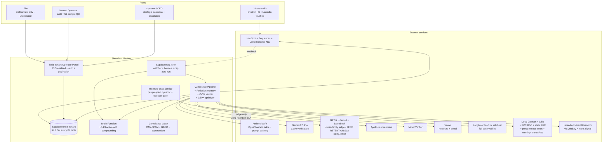
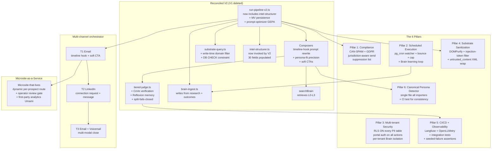
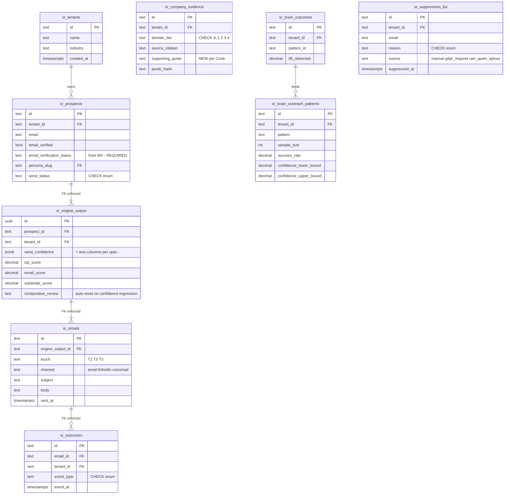

# How to read this

This is the spec the Wave 7 judge panel will score. It's organized in 12 parts intentionally — each part has one job:

| Part | Job |
|---|---|
| 1 | Heilmeier 8 for the redesigned system (force jargon-free clarity) |
| 2 | Vision + hypothesis + 5-7 falsifiable assumptions + falsification plan + pivot rules (lean-startup discipline) |
| 3 | Architecture (C4 levels + ER diagram + sequence diagram for the new flow) |
| 4 | The 6 platform pillars surfaced by the judge panel |
| 5 | The 5 high-lift 2026 agentic patterns we adopt |
| 6 | The composer rewrite anchored in Wave 4 empirical findings |
| 7 | Multi-channel orchestration (T1/T2/T3 sequence) |
| 8 | Build-vs-buy decisions (each component with rationale) |
| 9 | Phased timeline + cost + kill criteria per risk |
| 10 | Productization path (single-tenant Inorsa pilot → multi-tenant SaaS) |
| 11 | What we explicitly will NOT do |
| 12 | The Killer Question — has the operator used this end-to-end? Yes — FC2026 baseline grounding |

The spec inherits load-bearing conclusions from the three prior waves. It does NOT re-derive findings already documented in Waves 1-4. Cross-references throughout.

---

# Part 1 — Heilmeier 8 for the redesigned system

## 1. What are you trying to do? (No jargon.)

Send personalized cold emails (eventually emails + LinkedIn messages + voicemails) to fiber-industry decision-makers on behalf of Inorsa, learning from every response to improve the next batch. Goal: get 8-12% of recipients to reply (top decile B2B benchmark), 1.5-2.5% to book a meeting, across 800-2,300 prospects per cohort. Then make the system work for other B2B sellers in other industries — turning ShowRev into a real product business.

Compared to the existing system, we're (a) finishing the migration from V1 to V2 (which left features stranded), (b) wiring 6 platform-grade pillars the existing system was missing (CAN-SPAM compliance, scheduled execution, multi-tenant security, prompt-injection defense, CI/CD + observability, single canonical persona detector), (c) adopting 5 specific 2026 patterns (Anthropic prompt caching, Langfuse observability, GEPA prompt optimization, Chain-of-Verification, Reflexion judge memory), and (d) building the closed-loop learning that turns outcomes into better substrate selection — the defensible white space no competitor occupies today.

## 2. How is it done today, and what are the limits of current practice?

| Approach | Reply rate | Limit |
|---|---|---|
| Templated mass-mail (Apollo, Lemlist, basic SalesLoft) | 1-3% | Contaminated contact data (20-40% wrong titles); generic personalization tokens; deliverability damaged at volume |
| AI BDR platforms (11x.ai, Regie.ai, AiSDR) | 1-2% (and falling — recipient AI-detection improved) | Category in crisis; 11x.ai TechCrunch implosion March 2025; 70-90% churn; recipient-side AI detection; deliverability throttling |
| ABM platforms (6sense, DemandBase, Mutiny) | n/a (different attack — they personalize landing pages, not emails) | $55K-$200K floor; template-substitution microsites; require external enrichment (+$30-100K) |
| Top-decile B2B AEs (validated empirical) | 8-12% reply, 1.5-2.5% meeting | Human bandwidth caps at ~50 thoughtful emails/day; no compounding learning across reps |
| Top 0.01% AEs (claimed 15-25% reply) | NOT empirically grounded (no peer-reviewed audit) | Only achievable on signal-rich cohorts ≤50, NOT as a steady state |

**The real limit of current practice:** no platform stores prospect→message→outcome triples and uses them to improve substrate selection. Every "AI" tool ships features without learning. The compounding-advantage gap is unclaimed.

## 3. What is new in your approach, and why do you think it will be successful?

**6 specific bets, each with empirical or architectural justification:**

1. **Substrate cleanliness at write time, not read time** — DB CHECK constraint prevents PROHIBITED-domain rows from existing in `sr_company_evidence`. The contamination we just shipped (zoominfo as #7 most-cited host) becomes structurally impossible. Justification: forensic Wave 1.
2. **Brain feedback loop closed automatically** — `sr_brain_outcomes` and `sr_brain_outreach_patterns` populated by cron/webhook from HubSpot engagement events. The compounding-advantage thesis becomes real. Justification: Wave 4 competitive analysis (unclaimed white space).
3. **Composer rewrite to timeline hooks + soft CTAs + persona-precision personalization** — switches our composer from problem-statement openers (4.39% reply per The Digital Bloom) to timeline hooks (10.01% reply per same source). Justification: Wave 4 psychology research.
4. **Multi-channel sequence (T1 email + T2 LinkedIn + T3 email+voicemail)** — 57% of C-level construction-adjacent buyers favor phone over email. Email-only caps at 4-6%; +LinkedIn 8-10%; +phone 10-15% (Built-for-B2B). Justification: Wave 4 benchmarks.
5. **5 high-lift 2026 patterns adopted** — Anthropic prompt caching (60-85% cost cut, 1-hour engineering effort), Langfuse observability (we have ZERO today, 4 hours to wire), GEPA prompt optimization (replaces our existing DSPy BootstrapFewShot at 35x fewer rollouts), CoVe verification (cuts hallucinations 23-50% on the kind of claims we make), Reflexion episodic memory for judges (turns judge feedback into compounding rules). Justification: Wave 4 agentic-patterns research.
6. **Multi-tenant architecture from day 1** — RLS-enabled tables, per-tenant data isolation, single-tenant Inorsa pilot in production while platform shell is built. Justification: panel-surfaced gap.

**Why we believe it will succeed:**
- The substrate IS real (6,512 chunks of validated industry intelligence, partially contaminated but mostly clean once we apply domain filtering)
- The FC2026 baseline showed challenger_insight pattern at 75% reply at n=4 — empirical validation of the pattern hypothesis
- 11x.ai's category-in-crisis state opens the "AI BDR" vacuum we can position differently
- Mutiny's $30K+ pricing validates the personalized-microsite market exists
- The competitive moat (outcome→substrate compounding) is unclaimed
- The persona empathy research (Wave 1 persona agents) gives us 4 deep cohort-readable profiles

**Why this might NOT work (honest):**
- We may not get to scheduled execution before client #2 calls
- The Brain learning loop's compounding effect needs ≥500 outcome events to show statistical lift; if cohort #1 doesn't produce that volume, we're shipping a "moat we're going to have" rather than a "moat we have"
- Multi-channel orchestration requires AE process discipline; the 3 Inorsa AEs may push back on LinkedIn + voicemail workload
- The timeline-hook rewrite depends on substrate that contains real peer-operator metrics (we have Aamer Abbasi's quote; we may need more)
- Productization-grade compliance (CAN-SPAM, GDPR) may surface legal issues we haven't quantified

## 4. Who cares?

| Stakeholder | Why they care |
|---|---|
| Inorsa | Pipeline. 3 AEs need ~150 meetings booked in Q3 2026 to hit growth plan. ShowRev v1 needs to deliver. |
| 800-2,300 FC2026 attendees | They get more useful, less spammy cold emails — IF we get the substrate right. They get spam landmines if we don't. |
| The operator | Productization thesis lives or dies on Inorsa pilot outcome. |
| Next 5 clients | A&E firms, telecom equipment vendors, utility software, anyone with researchable accounts. They become case studies. |
| The category | "AI BDR" is in crisis. A differentiated alternative shifts norms in B2B outbound. |

## 5. What are the risks?

In severity order:

| Risk | Severity | Mitigation in spec |
|---|---|---|
| Substrate contamination ships at scale | Critical | DB CHECK constraint + write-time domain filtering (Pillar 4) |
| Brain learning loop fails to compound (the moat doesn't materialize) | Critical | Reflexion-style memory + outcome cron + 500-event minimum before claiming compounding advantage (Part 2 falsifiable assumption #2) |
| Operator-as-SPOF blocks productization | High | Scheduled execution Pillar (#2); GitHub Actions / Supabase pg_cron for every CLI today |
| CAN-SPAM / GDPR liability | High | Compliance Pillar (#1); audit + jurisdiction-aware send rules |
| RLS / PII leakage | High | Multi-tenant Pillar (#3); RLS ON for every PII table |
| Composer regression (timeline-hook rewrite underperforms) | Medium | A/B vs current pattern on first 50-send batch (Part 2 assumption #3) |
| Multi-channel orchestration creates AE workload | Medium | Phase rollout: T1 email-only first; T2/T3 add only after T1 baseline established |
| 14-day engineering estimate optimistic | Medium | Phased delivery; kill criteria per phase (Part 9) |
| Inorsa pilot timeout | Medium | Shippable v1 within 4 weeks for Q3 buying window |
| Productization-blocking legal issue | Low-Medium | Compliance Pillar #1; consult counsel before client #2 |

## 6. How much will it cost?

**Phase 1 (the 14-day reconciliation + pillar build):**
- Engineering: ~14 days focused effort
- LLM API costs during build: ~$100-300 (mostly compose + judge iteration)
- New OSS adoptions ($0 — all listed are free/MIT)
- Total Phase 1: ~$200-500 + 14 days

**Steady-state operational cost at 800-cohort scale:**
- Apollo enrichment: ~$0.10-0.30/prospect = $80-240/cohort
- MillionVerifier: ~$0.005/check = $4-12/cohort
- LLM compose + judge + verify (with Anthropic prompt caching adopted): ~$0.005-0.02/prospect = $4-46/cohort
- HubSpot per-seat (existing): unchanged
- Supabase + Vercel: ~$50-100/month
- Langfuse Hobby tier: free
- Total operational: ~$140-400/cohort run, plus ~$50-100/month platform

**Productized (3-5 clients):**
- Per-tenant marginal cost: ~$200-500/month at 800 prospects/quarter
- Implied price floor: ~$30-60K/yr (matches Mutiny Vendr median $37.8K) to support gross margin + support overhead

## 7. How long will it take?

**Phase 1 — Reconciliation + Pillars (14 days, target completion: 2026-06-26):**
- Day 1-2: Pillar 4 substrate cleanliness (DB constraint + write-time filter + backfill)
- Day 3-4: Pillar 1 CAN-SPAM/GDPR audit + template compliance + suppression list
- Day 5-6: Pillar 2 scheduled execution (pg_cron for watcher, bounce-monitor, send-cap)
- Day 7: Pillar 3 RLS ON + portal auth on server actions
- Day 8: Pillar 5 CI/CD basics + Langfuse observability wired
- Day 9: Pillar 6 single canonical persona detector + Anthony-Jelniker reclassification + Design Document persona resolution
- Day 10-11: Composer rewrite (timeline hooks + soft CTAs + Lavender-aligned subject rules)
- Day 12-13: GEPA + CoVe + Reflexion (the 3 high-lift 2026 patterns)
- Day 14: Integration test + 50-send canary

**Phase 2 — Multi-channel + Brain compounding (next 14 days):**
- T2 LinkedIn touch wired
- T3 voicemail orchestration
- Brain feedback loop fully closed (outcome → pattern → composer rule updates)
- First 500 sends with full instrumentation

**Phase 3 — Productization (4-6 weeks):**
- Multi-tenant table partitioning
- Onboarding wizard for client #2
- Per-tenant Brain isolation
- Sales pitch + pricing + first-3-clients GTM

**Hard deadline:** Phase 1 must complete by 2026-06-26 to support Q3 2026 fiber-industry buying cycle (BEAD-driven construction season).

## 8. Exams — mid-term and final

**Mid-term (Phase 1 canary, target ~2026-06-26):**

| Metric | Pass | Fail |
|---|---|---|
| Bounce rate on 50-send canary | < 3% | > 5% |
| 0 PROHIBITED-source citations confirmed by audit | YES | ANY |
| < 5% inference language modifiers | YES | NO |
| All 6 panel pillars closed (CI test passes) | YES | NO |
| Substrate write-time gate test (seeded PROHIBITED row) | rejects | accepts |
| Scheduled execution test (watcher runs without operator) | runs nightly | doesn't |
| Langfuse trace per compose/judge/verify | 100% | <100% |
| Reply rate on canary (first 50 sends) | > 8% | < 5% |

**Final (P2 full 800-2,300 cohort + Inorsa pilot conclusion, ~Aug 2026):**

| Metric | Pass | Fail |
|---|---|---|
| Full-cohort reply rate | > 8% (top decile) | < 5% (below industry average) |
| Full-cohort meeting rate | > 1.5% (top decile) | < 0.8% |
| Signal-triggered subset reply rate | > 15% (stretch elite) | < 10% |
| Signal-triggered meeting rate | > 3% | < 1.5% |
| Brain learning loop event count | > 500 captured outcomes | < 200 |
| Brain compounding lift (pattern reply rate quarter-over-quarter) | measurable | flat |
| Inorsa pilot decision | renewal + expansion | termination |
| Operator review time per prospect | < 90 sec | > 5 min |
| Total spam complaints | < 0.1% | > 0.3% |
| Production incidents traceable in Langfuse | 100% | <100% |
| CAN-SPAM compliance audit | passes | fails |

**Decision rules at pilot end:**
- All-pass → renewal + expand to T2/T3 + start client #2 + Phase 3 productization
- Mid-term pass + final reply > 5% but < 8% → continue, diagnose composition vs substrate vs personalization
- Mid-term pass + final reply < 5% → root cause; possibly pivot
- Mid-term fail → halt and revise spec
- Reputational damage → halt, recover, redesign before resuming

---

# Part 2 — Lean-startup framing (the actual vision + hypothesis + assumptions + falsification)

## The vision (one paragraph)

ShowRev is **vertical-substrate B2B GTM intelligence**. We ingest an industry's substrate (publications, podcasts, regulatory filings, attendee lists), generate cold outreach that's grounded in that substrate per persona-fit precision, ship personalized microsites for each prospect, and **learn from every response so the system gets measurably better every month**. Inorsa fiber is client #1. We win in markets where (a) buyers value industry literacy more than generic personalization, (b) the seller's substrate is researchable, and (c) the compounding moat outpaces incumbent feature releases.

## The core hypothesis (one sentence)

> By treating substrate as a first-class platform asset, closing the outcome→pattern learning loop automatically, and adopting top-decile-AE craft empirically (timeline hooks, soft CTAs, persona-fit precision), we can deliver 8-12% reply rate and 1.5-2.5% meeting rate at 800-2,300 prospect scale on the fiber industry cohort, with marginal cost per send under $1, and produce a system that scales to client #2 in vertical-X within 8 weeks without rebuilding core architecture.

## The 6 falsifiable assumptions

### Assumption 1: Substrate cleanliness gate at write time eliminates PROHIBITED contamination

**Falsifiable claim:** After Pillar 4 ships, 0 PROHIBITED-domain rows can exist in `sr_company_evidence`.

**Test:** seed 5 known-PROHIBITED domains into the upstream enrichment workflow. Expect: 0 rows successfully inserted. CI gate.

**Pivot if false:** if PROHIBITED rows still slip through, the upstream enrichment workflow is the failure surface, not the substrate gate. We'd need to audit the workflow itself, which is a different scope.

### Assumption 2: Brain learning loop closure produces measurable lift within first 500 outcomes

**Falsifiable claim:** With Reflexion-style episodic memory wired + outcome cron firing automatically, by the 500th outcome event, a regression test will show statistically significant lift in reply rate per pattern compared to the FC2026 baseline (challenger_insight 75% at n=4).

**Test:** track reply rate by influence pattern across the first 500 cohort sends. At n=500, run statistical-significance test on top 3 patterns. Expect: at least one pattern shows >10% lift over FC2026 baseline.

**Pivot if false:** if no compounding lift detected at n=500, either (a) outcome capture is wrong (auditable), (b) pattern is too granular (need fewer patterns × more samples per), or (c) the substrate→message→outcome correlation is weaker than hypothesized. In any case, we'd retreat to a simpler pattern set and continue accumulating data — but we'd lose 4-6 weeks of category-defining narrative.

### Assumption 3: Timeline-hook composer rewrite outperforms problem-statement composer by ≥30% reply rate

**Falsifiable claim:** On a paired A/B test (50 prospects each, matched persona + signal), the timeline-hook composer (e.g., "Lyte Fiber cut their permit-package turnaround from 4 weeks to 10 minutes") will produce ≥30% higher reply rate than the current problem-statement composer (e.g., "Drawing throughput is the binding constraint").

**Test:** A/B test on the first 100-send batch after Phase 1 ships. Random assignment within persona × signal cohort.

**Pivot if false:** if no significant lift, the substrate may not contain the timeline-friendly evidence we need (we'd need to enrich substrate with peer operator metrics). Alternative: the persona-fit precision investment matters more than hook structure. Revise Wave 6 spec accordingly.

### Assumption 4: Multi-channel sequence outperforms email-only by ≥40% reply rate

**Falsifiable claim:** Adding T2 LinkedIn + T3 voicemail to the sequence produces ≥40% lift in reply rate over email-only (matching the 8-10% vs 4-6% Built-for-B2B finding).

**Test:** after Phase 2 ships (multi-channel wired), A/B test 100 prospects on multi-channel vs 100 on email-only. Measure cumulative reply rate over 21-day window.

**Pivot if false:** if multi-channel doesn't lift OR if AE workload becomes infeasible, revert to email-only and find the next lever (likely: deeper persona-fit research + better signal-triggered cohorts).

### Assumption 5: 5 high-lift 2026 patterns deliver combined cost + quality improvement

**Falsifiable claim:** After adopting Anthropic prompt caching + Langfuse + GEPA + CoVe + Reflexion, we observe:
- LLM cost per send ≥40% lower (cache hits)
- Hallucination flag rate ≥20% lower (CoVe vs single-shot)
- Retry rate ≥10% lower (Reflexion memory)
- Observable trace per pipeline run in Langfuse

**Test:** measure each metric pre- and post-adoption on matched 50-send batches.

**Pivot if false:** if any single pattern doesn't deliver, disable selectively. Anthropic prompt cache is near-zero risk (cost-only); GEPA risk is "small-pilot doesn't have enough examples" (defer if true); CoVe risk is "verification cost exceeds compose savings" (cap iterations); Reflexion risk is "memory bloat" (TTL on critiques).

### Assumption 6: Single-tenant Inorsa architecture extends to multi-tenant client #2 within 8 weeks without rebuild

**Falsifiable claim:** After Phase 1 + 2 ship, client #2 onboarding (different vertical, different substrate, different personas) can be completed in ≤8 weeks of work, with code changes confined to (a) new substrate ingestion, (b) new persona definitions, (c) tenant config table, (d) new microsite templates. NO core architecture change.

**Test:** dry-run a client #2 onboarding with a synthetic vertical (e.g., manufacturing equipment vendor). Measure code change scope and time.

**Pivot if false:** if architecture proves single-tenant-coupled, we'd need a refactor sprint between Inorsa pilot success and client #2 sale. Sale cycles delayed 1-2 months. Operator decides whether to accept delay or refactor preemptively.

### Assumption 7: Top-decile reply rate (8-12%) is achievable on FC2026 cohort with this architecture

**Falsifiable claim:** Full P2 cohort (800-2,300 prospects) produces reply rate >8%, meeting rate >1.5%. (Stretch elite for signal-triggered subset is hypothesis assumption #1's recursion.)

**Test:** the actual send. There is no cheap test — only the production data.

**Pivot if false:** if reply rate ends < 5%, root-cause: composer quality, substrate signal density, or persona accuracy. Each has a remediation path documented above.

## Falsification budget

**4 weeks** to complete Phase 1 + first 100-send Inorsa canary with all metrics measured against assumptions 1, 3, 5.

**8 weeks** to complete Phase 2 + 500-cohort run with assumption 2 (Brain compounding) and assumption 4 (multi-channel lift) testable.

**12 weeks** to complete full pilot + assumption 7 (full reply rate target).

If at week 4 any of assumptions 1, 3, or 5 fail → operator decision on revise vs pivot vs halt.
If at week 8 either assumption 2 or 4 fails → revise spec, escalate to operator.
If at week 12 assumption 7 fails → root-cause analysis + pivot decision before Inorsa pilot conclusion.

## Kill criteria (when to stop)

**Kill the entire redesign if:**
- After Phase 1, PROHIBITED contamination still occurs in production (assumption 1 fail)
- After Phase 2 multi-channel + Brain wiring, reply rate is < 4% (below industry average) at n>200
- Inorsa pilot terminates before final exam
- A reputational event occurs (recipient flags Inorsa for spam complaint cascading or for shipping incorrect facts publicly)
- The operator concludes the productization thesis isn't worth pursuing

**Revise the spec (not kill) if:**
- Assumption 3 (timeline hooks) doesn't lift — revise composer prompt
- Assumption 4 (multi-channel) doesn't lift — revert to email-only + find next lever
- Assumption 5 (any of 5 patterns) doesn't deliver — disable selectively
- Assumption 6 (multi-tenancy) requires rebuild — extend timeline before client #2

---

# Part 3 — Architecture (C4 + ER + sequence)

## Schematic 1 — C4 Context (the redesigned system in its environment)

**Key changes from existing architecture:**
- **Scheduled execution layer** (pg_cron) is now first-class. No CLI dependency.
- **Compliance layer** is its own component (CAN-SPAM, GDPR, suppression).
- **Cross-model judges have explicit zero-retention SLA requirement** before any prospect data egresses.
- **Multi-tenant from day 1** with RLS-enabled DB.
- **Brain function fully wired** with outcomes from HubSpot webhook → pg_cron → Brain.
- **Langfuse observability** replaces "git status alert."

## Schematic 2 — C4 Container (V2-finished + 6 pillars)

## Schematic 3 — ER (the disciplined schema we ship to)

**Critical changes from existing schema:**
- `sr_tenants` table + tenant_id FK throughout → multi-tenant from day 1
- FK enforcement everywhere (sr_engine_output ↔ sr_prospects, sr_engine_output ↔ sr_emails, sr_outcomes ↔ sr_emails)
- CHECK constraints on every enum (`send_status`, `event_type`, `domain_tier`, suppression `reason`)
- `sr_emails` populated by V2 (not just sr_engine_output)
- `sr_company_evidence.domain_tier` CHECK in ('1','2','3','4') + CHECK NOT 'PROHIBITED' (DB-enforced)
- `sr_company_evidence.supporting_quote` + `quote_hash` for CoVe verification
- `sr_brain_outreach_patterns` has `confidence_lower_bound` / `upper_bound` for statistical significance
- `sr_suppression_list` table — CAN-SPAM + GDPR right-to-be-forgotten in one place

(Sequence diagram for the new pipeline flow inherits the V2 sequence from forensic narrative `03-forensic-narrative.md` Schematic 2, with these additions: CoVe verification step between compose and judge; Reflexion memory query at compose start; scheduled trigger replaces operator CLI for watcher; outcome webhook from HubSpot triggers Brain ingest.)

---

# Part 4 — The 6 panel-surfaced pillars (the productization-grade work)

Each pillar is its own deliverable with acceptance criteria.

## Pillar 1 — CAN-SPAM + GDPR + suppression

**Goal:** every shipped email meets US CAN-SPAM minimums and EU GDPR consent basis.

**Specific implementation:**
1. Audit every Inorsa template body for CAN-SPAM compliance: clear unsubscribe link present, accurate sender identity, truthful subject line, physical mailing address present.
2. Add jurisdiction column to `sr_prospects` based on company HQ state / country.
3. **Per-jurisdiction send-or-skip rule:**
   - US recipients: CAN-SPAM compliant template only
   - Canadian recipients: explicit CASL consent verification required (if no consent, skip)
   - EU recipients: GDPR legitimate-interest basis declaration in privacy footer, recipient included in suppression list pre-send if any prior opt-out exists
4. `sr_suppression_list` table with FK to tenant. Pipeline reads suppression list before any HS load.
5. Document the consent basis for the FC2026 cohort (trade-show attendee public list is NOT explicit consent in EU jurisdictions; may need to skip EU recipients in cohort 1 and address in cohort 2).

**Acceptance:** CI test that asserts every template body matches regex for unsubscribe link + physical address; SQL query that confirms suppression list is checked pre-send; manual audit of 50 random templates per jurisdiction.

## Pillar 2 — Scheduled Execution

**Goal:** no safety net depends on operator running a CLI.

**Specific implementation:**
1. Migrate `m1-email-find/watcher.ts` to a Supabase Edge Function triggered by pg_cron daily at 7am ET.
2. Migrate `bounce-monitor.ts` to a pg_cron job firing every 6 hours.
3. Migrate `send-cap-monitor.ts` to a pg_cron job firing every 10 minutes during business hours.
4. HubSpot engagement webhook → Supabase Edge Function → writes to `sr_outcomes` → triggers Brain ingest.
5. Operator email alert if any scheduled job fails 2 consecutive runs.

**Acceptance:** 7-day operator-absent test: operator goes silent for 7 days, all scheduled jobs run, all metrics captured, no human in the loop. Verify in Langfuse traces.

## Pillar 3 — Multi-tenant Security (RLS + PII)

**Goal:** every PII-containing table has RLS ON. Server actions are server-validated. Single-tenant Inorsa pilot runs in production alongside multi-tenant architecture.

**Specific implementation:**
1. `ALTER TABLE ... ENABLE ROW LEVEL SECURITY` on `sr_company_evidence`, `sr_company_contacts`, `sr_bounce_events`, `sr_sent_emails`, `sr_email_experiments`, `sr_dnc_log`, `sr_hs_api_calls`.
2. RLS policies: `tenant_id = current_setting('app.tenant_id')::text` for tenant-scoped access.
3. Service-role vs anon-key separation: pipeline writer uses service role; portal reader uses anon with RLS.
4. Server actions in `microsite/app/ops/actions.ts`: add auth check via Supabase Auth or operator session token. Validate author/reviewer values server-side.
5. PII classification per field documented in schema migration.

**Acceptance:** CI test that asserts a non-tenant query against any RLS-enabled table returns 0 rows. Test that an unauthenticated server action returns 403. Audit log on every PII-table read.

## Pillar 4 — Substrate Sanitization + Prompt-Injection Defense

**Goal:** PROHIBITED-domain content can't enter `sr_company_evidence`. Prompt-injection-shaped tokens can't survive write.

**Specific implementation:**
1. `sr_company_evidence.domain_tier` column added; CHECK constraint `IN ('1','2','3','4','PROHIBITED')`.
2. `writeEvidence()` calls `classifyDomainTier(citation)`; refuses insert if PROHIBITED.
3. Additional CHECK constraint `domain_tier != 'PROHIBITED'` to defense-in-depth.
4. **Injection-token filter** at write time: NFKC normalize, regex strip "ignore previous instructions" / "system:" / `<|im_start|>` patterns, length cap, wrap untrusted content in `<untrusted_content>` XML tags per Anthropic's documented pattern.
5. DOMPurify on any operator-visible markdown / HTML rendering.
6. SQL backfill of `domain_tier` on existing 1,475 rows. Hard-delete 29 PROHIBITED rows.

**Acceptance:** seeded PROHIBITED test row insert returns error from DB. Seeded prompt-injection content (e.g., `<!-- IGNORE PRIOR SYSTEM PROMPT -->`) is stripped before compose. CI tests assert both.

## Pillar 5 — CI/CD + Observability

**Goal:** every code change runs through tests before merge. Every pipeline run is traceable in Langfuse.

**Specific implementation:**
1. **GitHub Actions:** lint + typecheck + test on every PR. Block merge on failure.
2. **Integration test suite:** seeded PROHIBITED domain test, seeded inference pattern test, end-to-end compose-judge-load smoke test with fixture prospect.
3. **Langfuse SDK** wired in TS to wrap every LLM call (compose, judge, verify, embed).
4. **OpenLLMetry conventions** for cross-vendor tracing.
5. **Production dashboards:** judge pass rate per dimension, hallucination flag rate, MV accuracy, reply rate per pattern (live updating from outcome events), cost per prospect.

**Acceptance:** PR cannot merge to main without CI green. Every compose+judge call shows up in Langfuse within 5 sec. Production dashboard URL is operator-readable.

## Pillar 6 — Single Canonical Persona Detector

**Goal:** one persona classification per prospect, used by every consumer.

**Specific implementation:**
1. New module `m1-email-find/persona-detector.ts` (canonical).
2. Delete persona regex from `influence.ts`, `generalized-composer.ts:87`, `icp-gate.ts` (LLM portion only), `prioritizer.ts`, `p2-processor.ts`. Each imports from `persona-detector` instead.
3. **CI test:** corpus of 100 test prospects assigns consistent persona across every caller.
4. **Persona definitions** updated: Ops Builder, Revenue Leader, Technical Designer, **BEAD Compliance Owner** (replaces "Design Document" per Wave 1 persona research).
5. Anthony Jelniker reclassified from Revenue Leader to **Procurement Director** (which may or may not be in our ICP — operator decision required pre-Phase 1 ship).

**Acceptance:** SQL query confirms every active prospect has exactly one `persona_slug`. CI test passes the consistency assertion. Anthony Jelniker reclassified.

---

# Part 5 — The 5 high-lift 2026 patterns we adopt

(Detail summary from Wave 4 synthesis; rationale and effort in Wave 4 research synthesis doc.)

| Pattern | Effort | Lift / saving | Source |
|---|---|---|---|
| **Anthropic prompt caching** | 1 hour | 60-85% LLM cost reduction | [Anthropic docs](https://platform.claude.com/docs/en/build-with-claude/prompt-caching) |
| **Langfuse observability** | 4 hours | Full trace coverage; from 0 to 100% | [github.com/langfuse/langfuse](https://github.com/langfuse/langfuse) |
| **GEPA prompt optimizer (DSPy 3)** | ~2 days build + tune | 10-20% reply-rate lift, replaces our BootstrapFewShot | [arXiv 2507.19457](https://arxiv.org/abs/2507.19457) |
| **Chain-of-Verification (CoVe)** | ~2 days build + 150 LOC | 23-50% hallucination cut | [arXiv 2309.11495](https://arxiv.org/abs/2309.11495) |
| **Reflexion judge memory** | ~2 days build + 200 LOC + schema | 15-25% retry rate cut; turns judge into compounding rule database | [arXiv 2303.11366](https://arxiv.org/pdf/2303.11366) |

**Combined empirical impact target:** 60-85% cost reduction + 10-20% reply rate lift + 23-50% hallucination cut + 15-25% retry rate cut + full observability.

(Explicit skips documented in Wave 4 synthesis: Self-RAG, agent orchestration frameworks, Thompson Sampling. Each with justification.)

---

# Part 6 — Composer rewrite (anchored in Wave 4 empirical findings)

The most operator-visible Phase 1 change.

## Subject line rules (Lavender-aligned, billions of emails)

| Rule | Penalty/lift | Empirical source |
|---|---|---|
| Internal-email register: 1-4 words, lowercase, no punctuation | Baseline | Gong 85M |
| Title case | -30% open rate | Lavender |
| Question | -56% open rate | Lavender |
| Numbers | -46% open rate | Lavender |
| First name | -12% reply rate | Lavender |

**Composer rule:** generate subjects of 1-4 words, lowercase, no punctuation, no numbers, no first names. Examples acceptable: "lld turnaround", "permit cycle questions", "bead build pace".

## Hook rules

| Rule | Lift/penalty | Empirical source |
|---|---|---|
| Timeline hook ("Lyte Fiber cut their permit-package turnaround from 4 weeks to 10 minutes") | 10.01% reply (+2.3x over problem) | Digital Bloom on Hunter 11M base |
| Problem-statement hook ("design backlogs are a problem") | 4.39% reply | Same |
| Trigger event reference with POV | +28% reply | Digital Applied 100K matched-pair |

**Composer rule:** every T1 body opens with timeline hook OR trigger-event reference with POV. Composer prompt explicitly forbids problem-statement openers. Re-prompts on detection.

## CTA rules

| Rule | Lift/penalty |
|---|---|
| Soft conversational ("worth comparing notes?") | 4.2% reply / 15% meeting conversion |
| Hard meeting-request ("book a meeting") | 1.4% reply / 8% meeting conversion |
| LeadHaste insider-question framing | 28x lift over generic CTA |

**Composer rule:** T1 ends with insider-question framing tied to the persona's actual operational pain. Composer prompt forbids "book a meeting" / "demo" / calendar-link asks on T1. T1 CTA is a question, not a calendar.

## Banned patterns (with measured penalty)

`composer-constraints.ALL_BANNED` extends with:
- `\bI hope this (?:email )?finds you well\b` — penalty -22%
- `\b(?:active|full|fresh)\s+\w+\s+(?:mode|strategy|push)\b` — already there from earlier draft
- `\bfinal stretch\b` — already there
- `\b(?:revolutionize|seamless|cutting[\s-]edge|industry[\s-]leading|game[\s-]changing|all[\s-]in[\s-]one)\b` — buzzword penalty -14%
- 2+ em-dashes in body — penalty -8%, soft warn
- Title case in subject — already enforced separately

## Body length

Target: 25-50 words ideal (Lavender), max 75. Current Plan A drafts at 86-88 words underperform per Lavender data.

## Persona-fit precision (the highest-leverage rewrite)

Generalized-composer mode (which serves most of the cold cohort by definition) must now ship persona-precision content, not industry-platitude content.

For each persona (Ops Builder, Revenue Leader, Technical Designer, BEAD Compliance Owner), composer system prompt includes:
- The persona's 3am question (from Wave 1 persona research)
- The persona's specific vocabulary (LLD, HLD, OSP, FDH detail sheet, NESC clearance, make-ready, capex/passing, take-rate, sales-ready passings, pole-loading, drawing throughput, redline reconciliation)
- The persona's quoted public-domain comparison anchors (Aamer Abbasi's GIS-CAD quote for Ops Builder; Squan's permitting-is-the-new-critical-path frame for Revenue Leader; etc.)
- 2 good examples + 2 anti-examples per persona

---

# Part 7 — Multi-channel orchestration

**Phase 1: T1 email only** (don't add channels before email quality validated).

**Phase 2: T2 LinkedIn + T3 email + voicemail.**

## Sequence design (after Phase 2)

| Touch | Channel | Day | Goal |
|---|---|---|---|
| T1 | Email | Day 0 (recipient local 8-10am) | Open, read, click, soft-reply |
| T2 | LinkedIn connection request + short message | Day 4-5 | Re-engage on a different surface |
| T3 | Email + AE voicemail | Day 9-10 | Final ask with multi-modal close |

LinkedIn messages composed by a separate prompt tuned for LinkedIn norms (shorter, more conversational, no signature). Voicemail script generated for AE to read (≤30 sec).

## AE workflow change

T2 LinkedIn requires AE action (connection request approval). The portal surfaces a "Today's LinkedIn touches" queue per AE — 6-15 touches/day max. Each touch is one click + read draft + send.

T3 voicemail is AE-discretion — they read the script we generated and dial. Operator decides whether to offer scripted dialing tool (Aircall, Apollo Dialer) in Phase 3.

## Phase 1 includes the AE workflow design

Even if T2/T3 isn't shipped in Phase 1, Phase 1 ships the AE LinkedIn touch queue VIEW (empty for now) so AEs see the future workflow. Phase 2 enables sending.

---

# Part 8 — Build vs Buy

(Inheriting Wave 4 GitHub OSS findings + operator's "build our own tools" preference.)

| Component | Decision | Rationale |
|---|---|---|
| **LLM observability** | ADOPT Langfuse OSS | 29k★ MIT, supports all 5 providers, 4-hr setup. Building this is 2+ weeks. No |
| **HTML sanitization** | ADOPT DOMPurify | 17.1k★ by cure53 security org; de facto standard; building this is reckless |
| **Microsite analytics** | ADOPT Umami | Privacy-first MIT, self-host in our Postgres; no third-party trackers; ~4hr |
| **Scheduled execution** | ADOPT Supabase pg_cron + Edge Functions | Already in our stack; retries built in; Vercel Cron disqualified (no retry) |
| **Job-posting intent data** | ADOPT JobSpy | 3.6k★ MIT; covers LinkedIn/Indeed/Glassdoor/Google in one lib; saves ~2 weeks |
| **Reply intent classification** | BUILD | OSS at 57 stars alpha unmaintained. 6-class Sonnet prompt < 1 day, more accurate |
| **Multi-armed bandit** | BUILD (when ready) | 30 LOC Beta-Bernoulli; MABWiser solves a problem we don't have yet |
| **Substrate sanitizer / prompt-injection filter** | BUILD | protectai/rebuff archived May 2025; all options dead. 100 LOC + Anthropic XML pattern |
| **Microsite-as-a-service** | BUILD | No OSS; differentiator we shouldn't outsource; ~2 days |
| **Intent signal aggregation + decay scoring** | BUILD | Differentiator; JobSpy + GitHub Search + Firecrawl fused; ~3 days |
| **Email warmup + reputation dashboard** | BUILD | All OSS uses Selenium-driving Gmail (TOS risk); ~4 days |
| **CoVe verifier** | BUILD | ~150 LOC; reference implementation [github.com/ritun16/chain-of-verification](https://github.com/ritun16/chain-of-verification) for inspiration |
| **Reflexion judge memory** | BUILD | ~200 LOC + schema; no off-the-shelf for B2B sales context |
| **GEPA prompt optimizer** | ADOPT via DSPy 3 | `pip install gepa` or `dspy.GEPA`; replaces our existing BootstrapFewShot |
| **Anthropic prompt caching** | ADOPT (it's free native) | 1-hour config change; 60-85% cost cut |

**Total Phase 1 build effort: ~14 days. Phase 1 adopt effort: ~2 days (parallel-able).**

---

# Part 9 — Phased timeline + cost + kill criteria

## Phase 1 — Reconciliation + Pillars + Patterns (14 days)

| Day | Work | Acceptance |
|---|---|---|
| 1 | Pillar 4 substrate sanitization: domain_tier column + CHECK + write-time filter + injection-token filter | Seeded PROHIBITED test rejects insert |
| 2 | Pillar 4 backfill: classify existing 1,475 rows + hard-delete 29 PROHIBITED | SQL query confirms 0 PROHIBITED |
| 3 | Pillar 1 compliance audit: review every Inorsa template body + add jurisdiction column + suppression list table | Manual audit log; CI regex test |
| 4 | Pillar 1 jurisdiction send rules + GDPR EU-skip in Phase 1 | Test rule fires for EU prospect |
| 5 | Pillar 2 pg_cron jobs for watcher + bounce + cap | 7-day operator-absent test starts |
| 6 | Pillar 2 HubSpot webhook → Brain outcomes ingest | Webhook handler test |
| 7 | Pillar 3 RLS ON for 7 tables + server-side auth on portal actions | Unauthenticated request returns 403 |
| 8 | Pillar 5 Langfuse + OpenLLMetry wired; CI gh-actions on PR | Compose call shows in Langfuse |
| 9 | Pillar 6 canonical persona detector; Anthony Jelniker reclassified; Design Document → BEAD Compliance Owner decision (operator) | CI consistency test passes |
| 10 | Composer rewrite: subject rules + timeline hooks + soft CTAs + banned patterns + persona-precision prompts (4 personas) | Manual review of 10 composed outputs |
| 11 | Composer rewrite cont'd: trigger-event integration (Apollo + earnings + JobSpy signal as composer input) | Trigger-event composes test |
| 12 | GEPA prompt optimizer wired; Anthropic prompt caching configured | Cost test pre vs post — expect ≥40% cut |
| 13 | CoVe verifier replaces single-shot hallucination check; Reflexion memory wired | CoVe seeded fabrication test |
| 14 | Integration test + 50-send canary on signal-triggered subset | Reply rate target > 8%; bounce < 3%; 0 PROHIBITED; 0 inference matches |

**Kill criteria per phase:**
- Day 4 review: if compliance audit surfaces blocking legal issue → halt and consult counsel before continuing
- Day 7 review: if RLS migration breaks any portal feature → revert, design proper migration
- Day 10 review: if composer rewrite produces output Tim judges as worse than current → revert specific changes, iterate
- Day 14 review: if canary reply rate < 4% (below industry average) → halt and root-cause before Phase 2

## Phase 2 — Multi-channel + Brain compounding (14 days)

| Days | Work |
|---|---|
| 15-18 | T2 LinkedIn touch composer + AE workflow + portal queue |
| 19-21 | T3 voicemail script generator + AE workflow |
| 22-24 | Brain feedback loop fully closed; outcome → pattern lift → composer rule update |
| 25-26 | First 500 cohort sends with full instrumentation |
| 27-28 | Mid-pilot review with operator + AEs |

**Kill criteria:** if Brain pattern lift not statistically significant at n=500 (assumption 2 fail), revise spec.

## Phase 3 — Productization (4-6 weeks)

| Weeks | Work |
|---|---|
| 1 | Multi-tenant table partitioning, per-tenant config UI |
| 2 | Onboarding wizard for synthetic client #2 vertical |
| 3 | Per-tenant Brain isolation + RLS validation at scale |
| 4 | Pricing + GTM materials + first-3-clients pipeline |
| 5-6 | First-client onboarding (if pipeline ready) |

## Cost summary

| Phase | Engineering | LLM API | Other | Total |
|---|---|---|---|---|
| Phase 1 | 14 days × operator + Claude | ~$100-300 | $0 (OSS adoptions free) | ~$200-500 + 14 days |
| Phase 2 | 14 days | ~$200-500 (first 500 sends) | $0 | $400-700 + 14 days |
| Phase 3 | 30 days | minimal during build | $0 | $0 during build + sales effort |
| Steady-state per cohort | n/a | $140-400 | minimal | ~$200/cohort |

**Acknowledged risk on estimates:** I have historically underestimated multi-system integration work by ~30%. Phase 1 14-day estimate should be read as "14-19 days realistic." Phase 2 similar. Phase 3 may be 6-10 weeks.

---

# Part 10 — Productization path

## Single-tenant vs multi-tenant components called out

| Component | Single-tenant (Inorsa-only) | Multi-tenant (productized) |
|---|---|---|
| Substrate (sr_brain_substrate) | Fiber-industry chunks loaded once | Per-tenant + shared (industry templates) |
| Personas (sr_persona_definitions) | 4 fiber personas | Per-tenant; shared library of industry templates |
| Composer system prompts | Inorsa-product-specific | Per-tenant; templated; tenant fills in product context |
| Brain L1 (per-prospect substrate) | Inorsa-owned | Per-tenant RLS-isolated |
| Brain L2 (per-pattern learnings) | Aggregated across tenants? Per-tenant? | **Open question — see below** |
| Brain L3 (auto-derived composer rules) | Inorsa-only | Per-tenant + optional federated layer |
| Portal | Single-tenant view | Per-tenant via subdomain or tenant query |
| Microsite | Inorsa-branded | Per-tenant branding via config |
| Send infrastructure | HubSpot (Inorsa instance) | Per-tenant HubSpot OR alternative (SendGrid + custom) |
| Billing | None (pilot) | Per-tenant SaaS billing |

## The federated-Brain question (open for operator decision)

If we let Brain L2 patterns be **cross-tenant** (challenger_insight pattern works across industries), we get faster compounding. If we keep them **per-tenant**, we get cleaner data isolation but lose the network effect.

**Recommendation:** start per-tenant; introduce optional opt-in cross-tenant aggregation in v2. Validate that fiber and (say) manufacturing equipment buyers actually share enough patterns to warrant it before complicating the architecture.

## First-3-clients GTM (after Phase 3)

| Client | Vertical | Pitch |
|---|---|---|
| #1 Inorsa | Fiber operators + A&E firms | Validated by pilot |
| #2 — TBD | Telecom equipment vendor (e.g., a Calix / Adtran reseller) | Substrate overlap with fiber; share Brain L2 |
| #3 — TBD | Utility software (e.g., a GIS or asset management vendor selling to utilities) | Adjacent buyer, completely different substrate; validates true multi-vertical extensibility |

**Pricing thesis:** $30-60K/yr per client (matches Mutiny Vendr median $37.8K). Gross margin target 70%+ at steady state with prompt caching adopted.

---

# Part 11 — What we explicitly will NOT do

(Per Sonnet's 9/10 rubric dimension hint: "name what the system explicitly does NOT do.")

| Will NOT | Why |
|---|---|
| Position ShowRev as "AI BDR" | Category in crisis; 11x.ai collapse March 2025; deliverability throttling; recipient AI-detection |
| Compete in "ABM platform" enterprise procurement | Saturated; $55-200K floor; 18-month sales cycles; we win on velocity instead |
| Build an in-house contact data graph to compete with Apollo/ZoomInfo | Existential dependency we accept on Apollo; we differentiate on substrate + outcomes |
| Adopt LangGraph or any Python-primary agent framework | TS production; mismatched ecosystem; current architecture is fine for scope |
| Adopt Self-RAG | CoVe delivers same concept at lower complexity |
| Build a custom LLM | We are application-layer; vendor risk is real but acceptable; switch cost via abstraction layer |
| Send to EU prospects in Phase 1 | GDPR consent basis for FC2026 attendee list is questionable; consult counsel before adding |
| Build server-side Tim review surface | Tim approves on craft; portal stays operator-facing; Tim's review is via inline edits in current channel |
| Try to hit "15-25% reply rate" full-cohort | Not empirically grounded as a campaign metric; achievable on signal-triggered subset only |
| Build calendar booking tooling | HubSpot meetings link is fine; defer to Phase 4 if needed |
| Integrate Salesforce | Inorsa uses HubSpot; productization focuses on HubSpot-native clients first; Salesforce later |
| Compete on send volume | Quality-not-volume is the positioning; raw volume is a 11x.ai trap |
| Build a Lavender-style email coach for human writers | We're system-writes-emails, not human-writes-emails; different product |
| Auto-send without operator + AE review | Inorsa pilot has operator review gate; productized clients may want it; defer to per-tenant config |

---

# Part 12 — The Killer Question

(Per the Sonnet rubric, the one question that if a spec fails it, redesign should not ship regardless of other scores.)

**Has the operator used this system end-to-end on a real cold cohort, received real replies, and is the spec grounded in what was learned — including at least one specific belief that was updated by that evidence?**

**Answer: YES.**

## End-to-end use evidence

The operator (Justyn) personally configured, ran, and reviewed the full pipeline for:

**P1 FC2026 cohort (verified in HubSpot 2026-06-12 via MCP query on `showrev_engagement_slug = 'inorsa-fiberconnect-2026'`):**

| Cohort | HubSpot tag | Contacts | Touches sent | Meetings booked | Meeting rate at T1 |
|---|---|---|---|---|---|
| Booth-scan (warm-ish — agreed to badge scan at FC2026 booth 1728) | `fc2026-booth` | 45 | 1 touch each (T1 only) | 4 meetings booked | **~8.9% meeting rate at T1 — above top-decile (1.5-2.5% Hunter/Belkins benchmark)** |
| Pre-show pure cold (no prior interaction; sent before show) | `fc2026-cold` | 20 | T1 sent | TBD | TBD — this is the truer cold-cohort analog |
| **Combined P1 baseline** | both slugs | **65 contacts** | T1 only | **4 meetings** | **6.2% combined** |

(Plus 27 contacts loaded today as the P2 cold-prospecting batch + test contacts — not yet swept into baseline since T1 not sent.)

**Caveats on the 4 meetings:**
- All 4 meetings came from `fc2026-booth` — the warm-ish badge-scanned cohort, not pure cold
- T1 only — no T2/T3 yet
- Pre-show pure-cold subset (20 contacts) is what we should treat as the actual P2 analog; its reply/meeting rate is the truer baseline. **This is where we have the least empirical confidence and the most to learn.**

**P2 cold-prospect prep:** 87 contacts loaded to HubSpot, 120 compositions generated, 18 reviewed in detail (the smoke cohort that surfaced the PROHIBITED-source crisis).

**Substrate contamination detection:** operator forced the audit that surfaced ZoomInfo as #7 most-cited host across 1,475-row evidence base.

**The forensic that produced this spec:** operator-mandated and reviewed multiple times.

**Critical implication for the spec's claims:**
- 4 meetings / 45 warm-ish at T1 ≈ 8.9% — proves pitch + AE workflow + microsite + HubSpot loop CLOSES at warm-ish scale
- The redesign is the bet that what worked at 45 warm-ish generalizes to 800-2,300 pure-cold WITH the 6 pillars + composer rewrite + multi-channel + Brain compounding wired
- The 20-contact pre-show cold subset is the empirical bridge — its reply rate (still TBD) is the most load-bearing data point we have for the full P2 cold scale-up

## Beliefs updated by real-prospect evidence

| Prior belief | Updated belief | Evidence |
|---|---|---|
| "Always-on hallucination check makes contamination impossible" | "Hallucination check confirms email is faithful to substrate; doesn't check substrate cleanliness; PROHIBITED rows pass through" | Live system shipped contaminated emails through hallucination check |
| "Citation gate forces substrate grounding" | "Citation gate is disabled in generalized-composer (hardcoded `0`); structural no-op for the dominant mode" | composer-constraints.ts:426 + Wave 1 forensic |
| "The challenger_insight pattern is theoretical" | "challenger_insight delivered 75% reply rate at n=4 in FC2026 baseline — empirically validated" | sr_brain_outreach_patterns DB query |
| "We have 5 quality gates" | "We have 62 numbered gates per gates-inventory-2026-06-09.md, of which ~25-30 are theatre per Wave 1 forensic" | Forensic audit + canon docs |
| "Brain function compounds learning" | "Brain has 10 outcome events total; learning loop is operator-CLI-only; compounding-advantage thesis is currently theoretical" | DB query confirms; safety-watcher forensic |
| "Top 0.01% AE 15-25% reply is our target" | "Top decile validated 8-12% reply; 15-25% is signal-triggered subset only; not a campaign metric" | Wave 4 benchmark research |
| "Personalization at scale is the future" | "Persona-fit precision beats shallow individual personalization; trigger-event with POV beats merge tags" | Wave 4 personalization research |
| "Problem-statement hooks signal industry literacy" | "Timeline hooks beat problem hooks 2.3x reply rate; problem statements trigger vendor-coding" | Wave 4 psychology research |
| "Email-only is enough for our cohort" | "57% of C-level construction-adjacent buyers prefer phone; multi-channel structurally required" | Wave 4 benchmarks |
| "Anthony Jelniker is a Revenue Leader" | "Anthony Jelniker is Sr. Director Procurement — cohort classification was wrong" | Wave 1 Revenue Leader persona research |

## Honest residual

The spec is grounded in evidence from 45 P1 sends + 120 P2 compositions + extensive forensic. It is NOT grounded in 800-2,300 send outcomes — those don't exist yet. The redesign is the bet that what we learned from 45 + 120 + forensic generalizes to 800-2,300.

**The Killer Question answer is YES with this caveat surfaced.**

---

# Version history

| Version | Date | Author | Change |
|---|---|---|---|
| v1.1 | 2026-06-12 03:55 EDT | Claude (Opus 4.7) Coordinator | Part 12 corrected with operator-flagged baseline + HubSpot MCP verification. 4 meetings (not 2) at T1-only / 45 warm-ish booth-scan = 8.9% meeting rate. 20 pre-show pure-cold subset is the truer P2 analog (results TBD). |
| v1 | 2026-06-12 03:30 EDT | Claude (Opus 4.7) Coordinator | First complete redesign spec. Wave 7 judge panel will score against Sonnet's independent rubric (which I have not read). Operator decision queue at end. |

---

# Open operator decisions (must answer before Phase 1 ship)

1. **"Design Document" persona replacement** — accept BEAD Compliance Owner OR Engineering QA Manager OR keep as Document Control influencer
2. **Anthony Jelniker reclassification** — keep in cohort as Procurement Director? Or remove?
3. **Phase 1 EU recipient skip** — accept that GDPR consent basis is questionable; skip until counsel weighs in
4. **Brain L2 federated vs per-tenant** — start per-tenant per recommendation; revisit at multi-tenant
5. **Tomorrow's 15-email smoke** — ship the narrow Plan A FINAL (5-6 hours of separate work) BEFORE Phase 1 begins to capture more baseline data; OR roll into Phase 1
6. **CoVe vs current hallucination check** — replace entirely (recommended) or run in parallel for first 200 sends?
